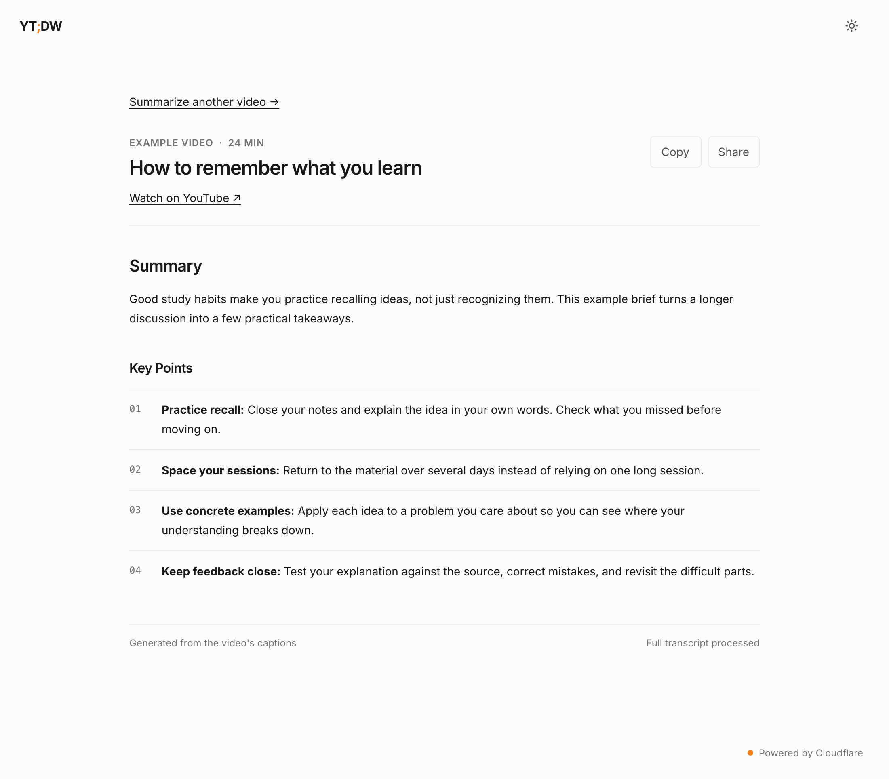
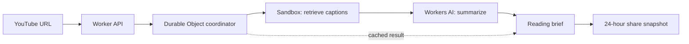

# YT;DW

**YouTube, Didn’t Watch.** Turn long YouTube videos into concise, structured reading briefs.



*The current shared-brief view, shown with illustrative sample content.*

**[Try it at ytdw.fyi →](https://ytdw.fyi/)**

## Long video. Short, useful brief.

- **Get the key points.** Turn videos with English captions into a readable summary with organized takeaways.
- **Take it with you.** Copy the brief as Markdown, with headings and numbered points intact.
- **Share the result.** Send a link others can read without generating the brief again. Links expire after 24 hours.

## How to use it

1. Paste a YouTube URL at **[ytdw.fyi](https://ytdw.fyi/)** and select **Summarize**.
2. Complete verification if prompted, then wait for the brief.
3. Read the summary, **Copy** it to your notes, or **Share** a link. Use **Watch on YouTube** to return to the source.

Share links are readable by anyone who has the link. Their 24-hour lifetime starts
when the snapshot is created, not when you click Share; opening or forwarding one
doesn’t extend it. Raw transcripts are discarded after processing.

## How it works



A small HTML, CSS, and JavaScript frontend sits on a Cloudflare Worker. Sandbox
runs `yt-dlp` to retrieve captions, and Workers AI creates the brief with
GLM 5.3 Flash. Turnstile and rate limits protect generation requests.

Three engineering choices keep the public app manageable:

- **Bounded work:** a Durable Object coordinator limits the processing queue and
  combines simultaneous requests for the same video.
- **Reusable results:** completed briefs are cached globally for 24 hours, with
  the edge Cache API providing another caching layer.
- **Temporary sharing:** each share snapshot has a fixed expiry, enforced on
  reads and cleaned up by a Durable Object alarm. Recipients don’t trigger another
  AI request.

## Run locally

Use a current Node.js LTS release and npm.

```bash
git clone https://github.com/simonhimself/ytdw.git
cd ytdw
npm install
npm run cf-typegen
```

For frontend work without running the Sandbox container:

```bash
npm run dev -- --enable-containers=false
```

This starts the app for UI development; it does not provide local video extraction.
Full generation needs Docker running for Sandbox, Cloudflare access for Workers AI,
and a Turnstile widget/secret configured for your development hostname. With those
set up, use `npm run dev`.

The checked-in deployment configuration targets the existing production account
and image. See the [operations guide](docs/OPERATIONS.md) before deploying a fork
or changing production settings.

### Validate changes

```bash
npm run typecheck
npm test
npm run test:ui
```

The tests use a real local Workers/SQLite runtime with mocked upstream services,
plus Chromium for browser checks. They need neither Docker nor production
credentials. Browser tests cover desktop/mobile widths in light and dark themes.

On macOS, the browser suite uses installed Google Chrome; otherwise install
Chromium with `npx playwright install chromium`. You can also set
`PLAYWRIGHT_CHROMIUM_EXECUTABLE_PATH` to use another local Chromium binary.

## Limitations

- Videos need public English captions and must be no longer than **six hours**.
- Transcript input is limited to **400,000 characters**.
- Briefs are based on captions, not visual content. AI summaries can miss nuance
  or make mistakes; use the original video when accuracy matters.
- The public service has limited processing capacity. Requests may queue or ask
  you to retry, and YouTube caption retrieval can be throttled.
- Share links are temporary, not a permanent archive. Copy a brief to keep it.

## Project guide

| File | Purpose |
| --- | --- |
| [`src/index.ts`](src/index.ts) | Worker API, transcript processing, caching, and Durable Objects |
| [`public/`](public/) | UI markup, behavior, and light/dark themes |
| [`docs/OPERATIONS.md`](docs/OPERATIONS.md) | Deployment, service limits, maintenance, and migration history |
| [`TEST_PLAN.md`](TEST_PLAN.md) | Validation scope and manual checks |
| [`TEST_RESULTS.md`](TEST_RESULTS.md) | Recorded test and deployment evidence |
